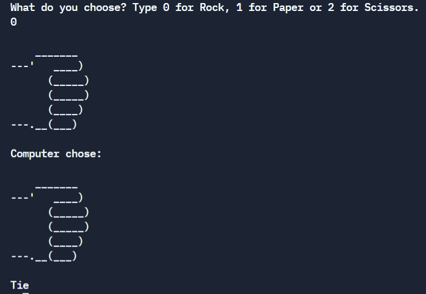
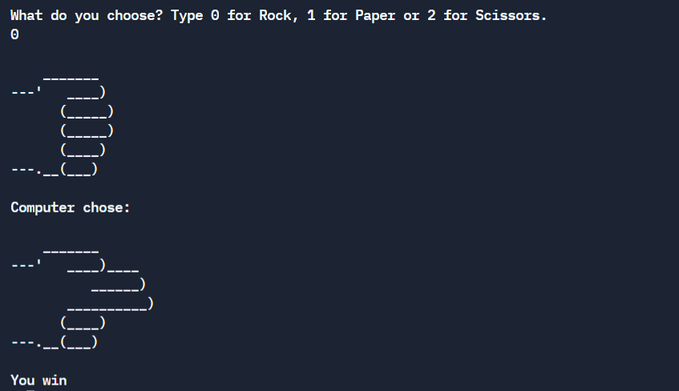
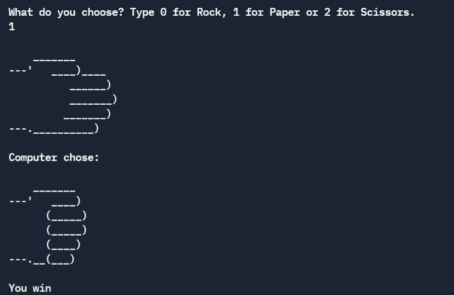
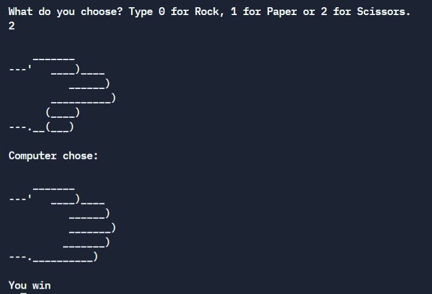

# Rock-Paper-Scissors Game in python

Console based game against CPU.

The outcome of the game is determined by 3 simple rules:
```
Rock wins against scissors.
Scissors win against paper.
Paper wins against rock.
```
Console output examples:





